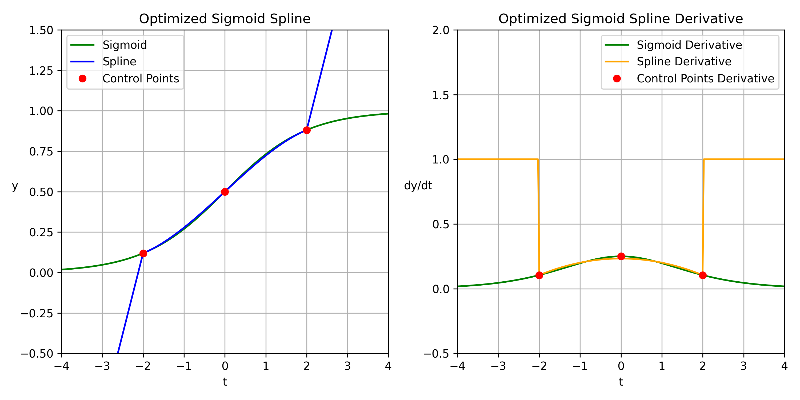

# Spline-VGP-Projekt

Untersuchung einer **Spline-basierten Sigmoid-Aktivierungsfunktion** zur Abschwächung des *Vanishing-Gradient-Problems (VGP)* in tiefen Feedforward-Netzen. Neben der eigenen Spline-Aktivierung werden **ReLU** und **Sigmoid** als Baselines verglichen.

> TL;DR: Kubische (Hermite-)Splines approximieren die Sigmoidkurve im Bereich `[-2, 2]`. Außerhalb läuft die Funktion linear aus – mit steilerer/konstanterer Ableitung, um VGP zu mildern.

---

## 🔬 Idee & Hypothese

- **Warum Spline?** Sigmoid sättigt für große |x| → Gradienten verschwinden. Die Spline-Variante verhält sich *sigmoid-ähnlich* nahe 0, läuft aber **linear** außerhalb `[-2, 2]`.  
- **Hypothese:** stabilere Gradienten in tiefen MLPs → weniger VGP-Effekte (sichtbar in Gradienten-Heatmaps), ohne die Robustheit von ReLU vollständig zu verlieren.

---

## 🧩 Aktivierungsfunktionen

- **ReLU**  
- **Sigmoid**
- **Spline (eigene Variante)** – sigmoid-nah im Kernbereich, linear außerhalb.

Die Spline ist über kubische Hermite-Splines implementiert, Parameter:
- `n`: Anzahl der Segmente innerhalb `[-x_limit, x_limit]` (Standard: 2)  
- `x_limit`: Spline-Kernbereich (Standard: 2)

Illustration (Sigmoid vs. Spline sowie Ableitungen):



---

## 📦 Datensätze

- **FashionMNIST** – 60 000 Graustufenbilder 28×28 (10 Klassen)  
- **CIFAR-10** – 50 000 Farbbilder 32×32 (10 Klassen)  
- **Tiny ImageNet-200** – 100 0000 Farbbilder 64x64 (200 Klassen)

Für FashionMNIST/CIFAR-10 dient das Testset als **Validation** (keine finale Testphase, Fokus auf Gradientenverläufe).

---

## 🛠️ Setup

Voraussetzungen:
- Python **3.11** (empfohlen)
- (Optional) NVIDIA-GPU mit CUDA 12.x

```bash
python -m venv venv
source venv/bin/activate     # Windows: venv\Scripts\activate
pip install -r requirements.txt
```

## Daten vorbereiten

FashionMNIST und CIFAR-10 werden automatisch geladen.
**Tiny ImageNet-200** bitte manuell laden, z. B.:

```bash
wget http://cs231n.stanford.edu/tiny-imagenet-200.zip
unzip tiny-imagenet-200.zip -d data/
```

Struktur (relevant):

```text
data/
└── tiny-imagenet-200/
    ├── train/
    └── val/
        ├── images/
        └── val_annotations.txt
```

---

## ⚙️ Konfigurationen

Experimente werden über YAML-Dateien definiert (Beispiel):

```yaml
# experiments/configs/spline_cifar10.yaml
experiment_name: spline_cifar10
seed: 42

dataset: cifar10          # fashionmnist | cifar10 | tiny_imagenet
batch_size: 1024
hidden_dim: 512
depth: 16                  # Anzahl versteckter Schichten (MLP)
activation: spline        # relu | sigmoid | spline
learning_rate: 1.0e-3
epochs: 250

log_dir: logs/spline_cifar10
```

---

## 🚀 Einzelexperiment starten

```bash
python experiments/run_experiment.py --config experiments/configs/spline_cifar10.yaml
```
- Logs: `logs/<experiment_name>/`
- Metriken: `metrics.csv`
- Trainingslog: `training.log`

Läuft auf GPU, falls verfügbar. Logs/Outputs:

- Metriken (pro Epoche/Parameter): logs/<experiment_name>/metrics.csv
- Konsolen-Log des Trainings: logs/<experiment_name>/training.log

---

## 🔁 Alle Experimente ausführen

Alle YAMLs in experiments/configs/ werden nacheinander trainiert und anschließend automatisch geplottet:

```bash
python run_all_experiments.py
```

Smoke-Runs (klein & schnell, ideal für Checks):

```bash
python run_all_experiments.py --smoke
# erzeugt zusammengehörige Smoke-Plots
```

---

## 📊 Auswertung & Plots

Alle vorhandenen CSV-Logs plotten:

```bash
python results/plots/plot_all.py
# oder smoke-Logs
python results/plots/plot_all.py --smoke
```

Erzeugt:

- **Gradient-Heatmaps** (log10 von mean-|gradient| und ‖grad‖)
- **Loss/Accuracy-Verläufe** (Train/Val, log10-Loss & Top-1-Accuracy)
- **Trainingszeiten**-Balkendiagramm

Ablage:
```text
results/
└── plots/
    ├── gradient_heatmaps/
    ├── loss_acc/
    └── train_times.png
```

---

## 🧱 Architektur (kurz)

- **Modell:** tiefes MLP (FNN), Bilder werden flach eingegeben.
- **Initialisierung:** Xavier-Uniform (Sigmoid/Spline), Kaiming-Uniform (ReLU).
- **Optimierer/Loss:** Adam + CrossEntropyLoss.
- **Logging:** pro Epoche Mittelwerte von mean-|Grad| und Grad-Norm je Parameter, inkl. Train/Val-Loss & -Accuracy.

---

## 🧪 Reproduzierbarkeit & Performance

- Feste Seeds für Python/NumPy/PyTorch; deterministische CUDNN-Einstellungen.
- TF32 und hohe MatMul-Präzision sind aktiviert (Ampere+), um Training zu beschleunigen.

---

## 📂 Projektstruktur

```text
spline-vgp-project/
├── data/
├── experiments/
│   ├── configs/            # YAML-Experimente (+ smoke/)
│   └── run_experiment.py   # Einzellauf
├── logs/                   # Metriken/Logs pro Experiment
├── models/
│   ├── activations.py      # Stellt Aktivierungen bereit
│   ├── feedforward.py      # FFN-Implementierung (MLP)
│   └── sigmoid_spline_activation.py  # Spline-basierte Sigmoid
├── results/
│   └── plots/              # Heatmaps, Loss/Acc, Zeiten
│       └── plot_all.py     # Auswertung & Plots (+ --smoke)
├── training/
│   ├── trainer.py          # Training/Eval + Gradienten-Logging
│   └── utils.py            # Dataloader, Seeds, Init
├── run_all_experiments.py   # Batch-Runner (+ --smoke)
├── requirements.txt
├── README.md
└── .gitignore
```

---

## ➕ Erweiterbarkeit

**Neue Aktivierung hinzufügen**

1. Implementierung als ``nn.Module`` (analog zur Spline).
2. In ``models/activations.py`` in ``get_activation(...)`` registrieren.
3. In YAML ``activation: <name>`` setzen.

**Neues Dataset**

1. Dataloader/Transforms in ``training/utils.py`` ergänzen.
2. Input/Output-Dim korrekt setzen.
3. YAML anpassen.
